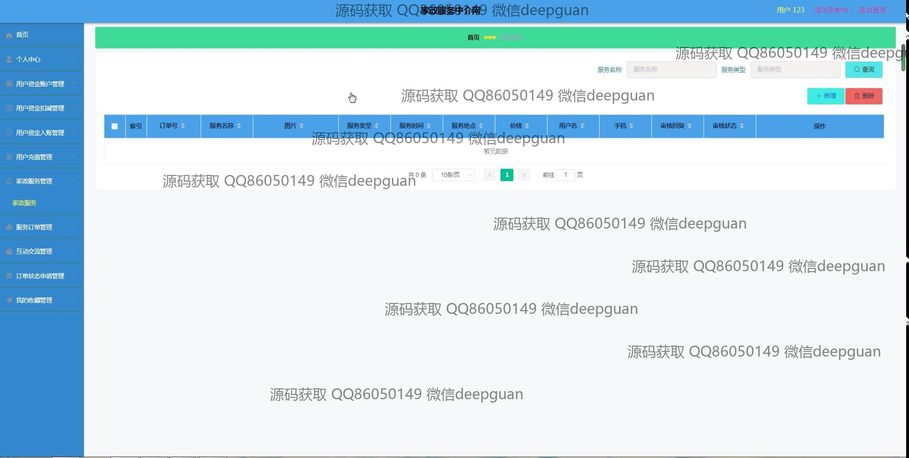
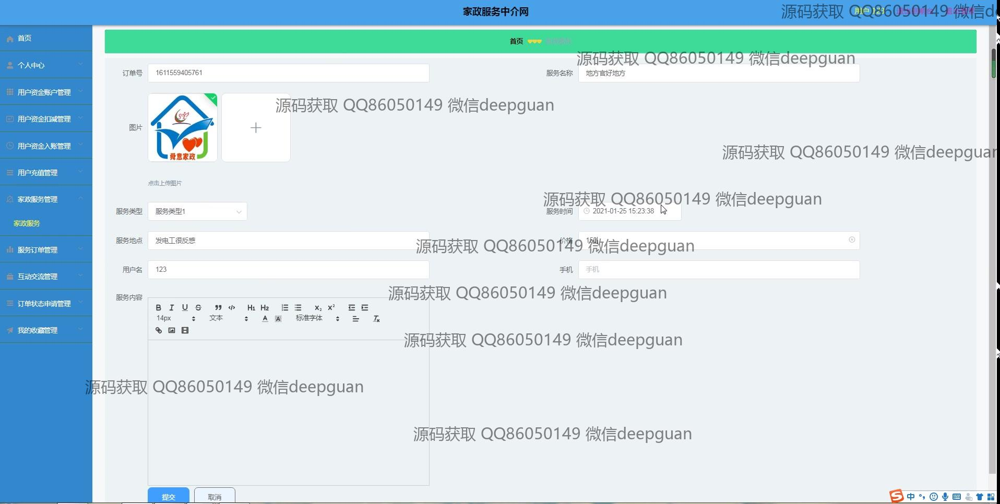
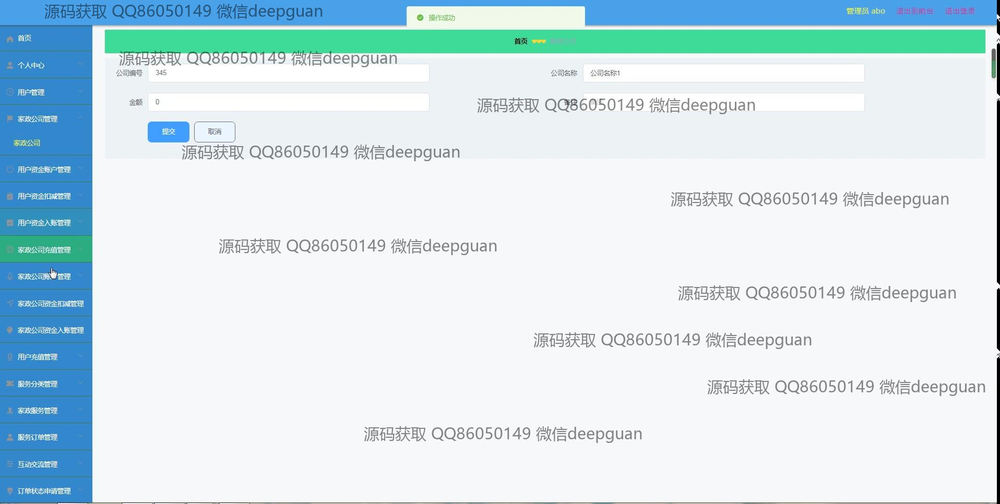

<h1 align="center">的家政服务中介网vue</h1>

## 简介
家政服务中介网：角色分为管理员、用户和家政公司；功能包括用户管理、家政公司管理、订单管理、用户资金账户管理、留言反馈、家政服务展示等。    --计算机毕业设计源码；毕设源码；java毕业设计源码

## 联系方式

<h3 align="center">获取完整代码与数据库文件 + 微信：deepguan QQ: 86050149 QQ群: 783742310</h3>

<h3 align="center">可帮忙远程部署 包运行成功！提供远程部署、修改代码、设计文档指导、代码讲解等服务！</h3>

## 功能介绍（完整见运行截图）
管理员： 基本功能包括登录、注册、退出操作，提供用户账户管理、家政公司管理、服务分类管理、订单管理、留言管理等核心后台功能；支持家政公司账户充值管理、用户资金账户管理以及订单审核和操作；能够新增、修改、删除相关数据，查看详细信息；提供快捷的搜索和筛选功能，优化后台操作效率；具备导航栏和模块化界面设计，清晰分区提升管理便捷性。

用户： 支持登录和注册功能，能够通过个人中心查看和修改个人信息，管理用户资金账户，进行充值或查询账户信息；访问家政服务列表，搜索和筛选订单；通过留言反馈模块与管理员互动；查看家政公司信息、服务分类和相关公告；界面设计注重简洁和功能性，便于用户高效操作。

家政公司： 提供家政公司账户管理功能，包括账户充值、资金查询等操作；支持添加和修改服务分类，发布服务订单并跟踪订单状态；能够上传和管理公司相关信息及图片内容；通过后台与管理员进行数据交互；具备服务评价管理模块，优化服务质量和用户体验。

访客： 可浏览网站首页的家政公司展示、服务列表、网站公告及自然风光等内容；使用搜索功能查找特定家政公司或服务信息；通过留言反馈模块提交建议或问题；导航栏设计简洁清晰，便于快速了解平台功能和服务内容。

## 运行截图

本代码来源于网络,仅供学习参考使用!

